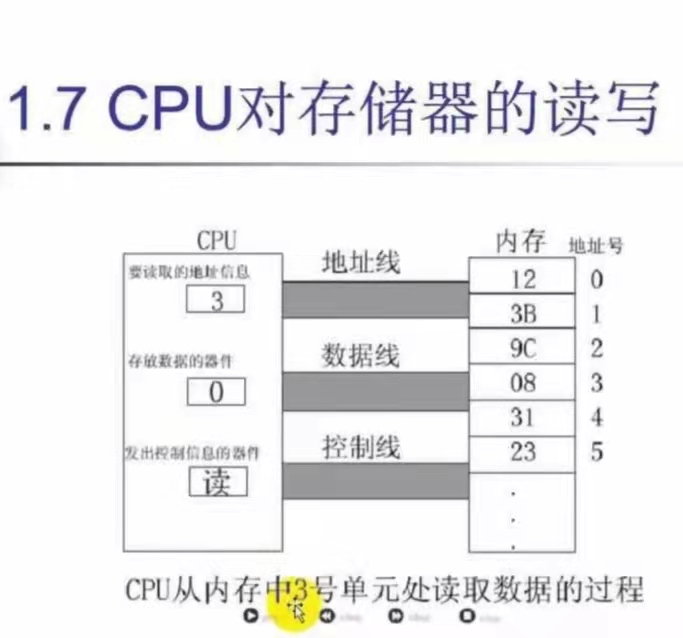

# 逆向工程

## I.汇编语言简介

### 一. 为什么要学习汇编
正常软件开发过程:C/C++源代码 ---(编译器)---> 汇编语言 ---(连接器)--->  机器语言

逆向开发: 机器语言 ---> **汇编语言** ---> C/C++源代码(但可用性非常低)

#### 字节 字 双字
- 字节 (1字节)  BYTE类型   unsigned char  0~255           0~0xFF
- 字   (2字节)  WORD类型   unsigned short 0~65535         0~0xFFFF
- 双字 (4字节)  DWORD类型  unsigned int   0~4294967295    0~0xFFFF FFFF


### 二. 进制转换
1.最传统的方法计算:

    ex:HexToDec CAFE=12*16^3+10*16^2+15*16^1+14*16^0=51966

2.假设进行十进制数(**小于65536**)向十六进制数转换:就对该数做以256为除数的除法,再对商做以16为除数的除法，对余数做以16为除数的除法,以此类推,直到不能再除为止

    ex: DecToHex: 51966/256=202......254
                  商202/16=12(C)......10(A)
                  余数254/16=15(F)......14(E)

3.从右到左分组,如果是8进制就三个为一组,16进制就4个为一组

    ex. BinToOct:10110110=266
                  2 6  6
        BinToHex: 1101 1010 1100 0011=DAC3
                   13   10   12   3     


### 三.CPU对存储器的读写

CPU要想进行数据的读写,必须和外部器件(标准说法是芯片)

进行三类信息的交互:

①存储单元的地址(地址信息)

②器件的选择,读或写命令(命令信息)

③读或写的数据(数据信息)

而在电脑中传递信息就需要电信号,而电信号的传递需要导线,所以:

    称用于连接CPU和其他芯片的导线为总线

逻辑上依次划分为:
* 地址总线,
* 数据总线,
* 控制总线,
  
分别用于传输相应的信息

####  地址总线

CPU是通过地址总线来制定存储单元的,地址总线上能传送多少个不同的信息,CPU就可以对多少个存储单元进行寻址(即导管越宽,每秒的水流量越大,传输就越快)

#### 数据总线

CPU与内存之间的数据传送是通过数据总线来进行的.数据总线的宽度决定了CPU与外界数据的传送速度(与地址总线同理)

#### 控制总线

CPU对外部器件的控制是通过控制总线来进行的.在这里控制总线是个总称,即控制总线是一些不同控制线的集合.

有多少跟控制总线,就意味着CPU提供了对外部期间的多少种控制,即控制总线的宽度决定了CPU对外部器件的控制能力

### 四.内存地址空间

什么是内存地址空间:一个CPU的地址总线宽度为`10`,那么说明该CPU可以同时寻址到`1024`个内存单元,这`1024个内存单元就构成了该CPU的内存地址空间`


## II.寄存器(CPU工作原理)

### 一.CPU概述

一个典型的CPU由运算器，控制器，寄存器等器件组成，这些器件靠内部总线相连

内部总线实现CPU内部各个器件之间的联系

外部总线实现CPU和主板上各个器件之间的联系

### 二.寄存器

#### 16位结构CPU

16位结构CPU有如下几个方面特征

- 运算器一次最多处理16位数据
- 寄存器的最大宽度为16位
- 寄存器和运算器之间的通路为16位

32位,64位同理

#### 8086CPU给出物理地址的方法

- 8086有20位的地址总线,可传送20位地址,即寻址能力为2^20=2^10*1024KB=1MB
- 8086内部为16位结构,他只能传送16位地址,即寻址能力只有2^16=2^6*1024KB=64KB

`8086如何完全使用1MB的寻址能力呢?`
    
    8086采用一种在内部用两个16为地址合成的方法来形成一个20位的物理地址

    即:物理地址=基地址+偏移地址 
     或 物理地址=段地址*16+偏移地址 

    c中位运算里的左移可以使数字扩大2倍,因此基地址×16即基地址左移4位
    而基地址本身为16位,左移4位后就是20位

    ex:  1111 1111 1111 1110 左移4位-->1111 1111 1111 1110 0000
    这里不会有数据丢失的问题,因为左移是在地址总线中左移的

### 三.段的概念

错误认识:
    
内存被划分为一个一个的段,每一个段都有一个段地址


正确:

内存并没有分段,端的划分来自于`CPU`,由于8086采用`物理地址=基地址+偏移地址`的方式给出内存单元的物理地址,使得我们可以用分段的方式管理内存


### 四.如何描述段

在8086PC机中,存储单元的地址用两个元素来描述

即段地址与偏移地址.

“数据在21F60H内存单元中”的描述方式有两种：

- 数据存在内存2000:1F60单元中
- 数据存在内存2000段中的1F60H单元中

### 五.段寄存器

段寄存器就是提供段地址的,8086CPU有四个段寄存器:CS,DS,SS,ES

当8086要访问内存时,由这四个段寄存器提供内存单元的段地址

#### CS与IP

CS与IP是8086中最关键的寄存器,他们指示了CPU当前要读取指令的地址

    其中CS为代码段寄存器==>传递段地址
        IP为指令指针寄存器==>传递偏移地址

#### 8086工作过程:

①CS:IP读取段地址和偏移地址,根据这两个地址在内存单元中读取指令,读取的指令进入指令缓冲器

②IP=IP+所读取指令的长度

③执行指令,转到①,重复该过程


`此外可以通过改变CS IP里面的值来控制CPU执行的指令`

`如果想做一个病毒,在开机之前执行自己的代码,就需要更改CS IP里面的值`


#### 内存中指令和数据没有任何区别,那么CPU在工作的时候把有的信息看做指令,有的信息看作数据,
#### CPU根据什么将内存中的信息看作指令呢？

    CPU将CS:IP指向的内存单元中的内容看作指令


#### 修改CS:IP中的指令

CPU从何处执行指令是由CS:IP中的内容决定的,CS:IP就像是CPU的两只手

所以我们可以通过改变CS:IP中的内容来控制CPU执行目标指令

        使用jmp可以同时修改CS,IP的内容
        jmp 段地址:偏移地址
            jmp 2AE3:3
            jmp 3:0B16
        功能:用指令中给出的段地址修改CS,偏移地址修改IP

        使用jmp也可以仅修改IP内的内容
        jmp 某一合法寄存器
            jmp ax
            jmp bx
        功能:用寄存器中的值修改IP

## III.寄存器(内存访问)

### 一.内存中字的存储(小端存储)

地位低字节 高位高字节


### 二.DS与[address]

- CPU读取一个内存单元时,必须先给出这个内存单元的地址
- 在8086中,内存地址由段地址和偏移地址组成
- 8086中有一个DS寄存器,用来`*存放要访问的数据的段地址*`
- TIPS:DS 与 CS IP不同在于DS是存储数据的段地址,而CS IP是存放代码的地址
  
为什么这里要用bx为中转站将1000移入ds而不是直接放呢？
    
        因为技术达不到

- 中括号里面的数代表偏移地址,类比于IP

mov al,[0]即

将10000H+0H地址的数据读到AL中

**即mov指令可以将一个内存单元中的内容送入一个寄存器,或将寄存器中的数据写入内存单元**

    还没写完


## IV.栈

push(入栈)

pop(出栈)

push ax:把寄存器ax中的数据送入栈中

pop ax:将栈顶数据取出,放入ax中

push指令的执行过程

    push ax
        1.sp=sp-2
        2.将ax中的内容送入SS:SP指向的内存单元处,此时SS:SP指向新的栈顶

        pop 同理


两个疑问:

    1.执行push和pop时,如何知道那个单元是栈顶单元
    2.CPU如何知道一段内存空间被当作栈使用?

- 8086CPU中有两个寄存器:SS,SP
    
    SS存放栈顶的段地址
    
    SP存放栈顶的偏移地址

    且任何时刻,SS:SP都指向栈顶元素


## V.第一个程序

### 一.一个源程序从写出到执行的过程

编写-->编译-->连接-->运行

### 二.可执行文件

可执行文件包括两部分内容

- 程序(从源程序中的汇编指令翻译过来的机器码)和数据(源程序中定义的数据)
- 相关的描述信息(程序有多大,占用多少空间)

### 三.源程序


- 汇编指令
  
  有对应的机器码的指令,可以被编译为机器码指令,最终被CPU执行
- 伪指令

  没有对应的机器码的指令,不被CPU执行
  
  因此,伪指令是由编译器来执行的命令,编译器根据伪指令来进行相关的编译工作

- 程序
  
  源程序最终由计算机执行、处理的指令和数据

### 四.程序返回
    mov ax,4c00H
    int 21H
    用来实现程序返回

### 五.第一个程序

- 编辑源程序==>编写汇编代码
- 编译==>进入DOS模式(右键进入)-->输入masm 文件名.asm 得到asd.obj
- 连接==>输入link 文件名.obj 得到文件名.exe
- `可以直接用ml 文件名.asm直接完成编译加连接`
- debug(调试跟踪)==>输入debug 文件名.exe  之后输入-u查询所有指令
  


## VI.[bx]和loop命令

### 一.[bx]和内存单元的描述

[bx]与[0]有些类似,bx也表示一个内存单元,他的偏移地址在bx中

而想要完整的描述一个内存单元,还需要两种信息

- 内存单元的地址
- 内存单元的长度(类型)

**我们用[0]表示一个内存单元时,0表示单元的偏移地址,段地址默认在ds中,单元长度(类型)可以有具体指令中的其他操作对象指出**


    ex:ds=1000H  bx=20H
        mov ax,[bx]  物理地址:ds:bx  1000:20  
        因为ax占两个字节
        ∴偏移[bx]位后的数据占两个字节
        
        mov al,[bx]  物理地址:ds:bx  1000:20  
        因为ax占一个字节
        ∴偏移[bx]位后的数据占一个字节

### 二.loop指令
指令格式: loop 标号   操作步骤:

- (cx)=(cx)-1
- 判断cx中的值,不为0则转至标号处执行,为0则向下执行

```assembly
assume cs:abc
abc segment
    mov ax,0123h
    mov cx,11
s:  add ax,ax
    loop s

    mov ax,4C00H
    int 21H
abc ends
end
```

标号 s:代表一个地址

loop s:进行两步操作
- (cx)=(cx)-1
- 判断cx中的值,不为0则转至标号处执行(即add ax,ax),为0则向下执行(即mov ax,4c00H)
  
#### 注意事项
- 1.在cx中存放循环次数
- 2.loop指令中的标号要放在前面
- 3.要循环执行的程序段要放在`标号`和`loop指令`的中间


```assembly
mov cx,执行次数
s:循环执行的程序段
loop s
```

##### 例题:求解5000*5

```assembly
assume cs:abc
abc segment
    mov ax,5h
    mov cx,5000
s:  add ax,ax
    loop s

    mov ax,4C00H
    int 21H
abc ends
end
```
`可以发现上述的代码循环了5000次,但是可以优化为将5000连加5次,这样开销大大减少`

### 三.bx与loop综合运用

有的时候需要循环解决的问题中,每次循环都会改变内存地址(连续的)

这是就需要bx与loop一起使用

### 四.几种寻址方式
- [常量]用一个常量来表示地址,可用于直接定位一个内存单元:`直接寻址`
- [bx]用一个变量来表示内存地址,可用于间接定位一个内存单元:`寄存器间接寻址`
- [bx+常量]用一个变量和常量表示地址,可在一个起始地址的基础上用变量间接定位一个内存单元地址:`寄存器相对寻址`
- [bx+si]用两个变量表示地址:`基址变址寻址`
- [bx+si+常量]用两个变量和一个常量表示地址:`相对基址变址寻址`
    
## VII.转移指令


转移指令分为以下几类:
- 无条件转移指令:jmp
- 条件转移指令
- 循环指令
- 过程(如函数调用)
- ~~中断~~
  
### 一.jmp指令

jmp为无条件转移,jmp指令需要给出两种信息:
- 转移的距离(段间转移,段内短转移,段内近转移)
- 转移的目的地址

#### 1.jmp short 标号(转到标号处执行指令)
实现段内短转移,IP的修改范围为-128~127,即向前最多越过128位,向后最多127位

```assembly
assume cs:abc
abc segment
    mov ax,0
    jmp short s
    add ax,1
    s:inc ax   
    
    mov ax,4C00H
    int 21H
abc ends
end
```

上述代码中,没有执行“add ax,1”的命令,而是跳转到s标号处的inc ax,“inc ax ”使ax自加1

`CPU执行jmp short 标号指令时不需要知道转移的目的地址,只需要知道转移的位移就行`

#### 2.jmp near ptr 标号
实现段内近转移,IP的修改范围为-32768~32767,即向前最多越过32768位,向后最多32767位

#### 3.jmp far ptr 标号
实现段间转移,(CS)=标号所在段的段地址,(IP)=标号所在段的偏移地址,

far ptr 指明了指令用标号的段地址和偏移地址修改CS和IP

```assembly
assume cs:abc
abc segment
    mov ax,0
    mov bx,0
    jmp far ptr s
    db 256 dup(0)

    s:  add ax,1
        inc ax
    
    mov ax,4C00H
    int 21H
abc ends
end
```


段间转移的效率更低


### 二.jcxz指令

jcxz为有条件转移指令,都是短转移

指令格式: jcxz 标号

如果(cx)=0,则转移到标号处执行,类比if条件句


## VIII.call和ret指令

### 一.ret和retf

- ret指令用栈中的数据,修改IP的内容,从而实现近转移
    
    CPU执行ret指令时,进行下面两步操作:
    - (IP)=((ss)*16+(sp))
    - (sp)=(sp)+2
- retf指令用栈中的数据,修改CS和IP的内容,从而实现远转移

    CPU执行ret指令时,进行下面四步操作:
    - (IP)=((ss)*16+(sp))
    - (sp)=(sp)+2
    - (CS)=((ss)*16+(sp))
    - (sp)=(sp)+2

`CPU执行ret指令相当于进行pop IP`

`CPU执行retf指令相当于进行pop IP,pop CS`

### 二.call

CPU执行call指令,进行两步操作:
- 将当前的IP或CS和IP压入栈中
- 转移

用法:

    call 标号(将当前的IP压入栈后,转到标号处执行指令)
    
执行call时,相当于进行:

    push IP
    jmp near ptr 标号


### 三.ret与call配合使用

通过call可以实现保存当前地址到栈中,并调用子程序

在子程序中,通过ret可以弹出栈中保存的地址,并跳转到地址对应的地方继续执行后面的程序

二者相互协作,就实现了既调用子程序,又保证调用完子程序,后面的代码还能继续运行


### 四.mul指令

相乘的两个数要么都是16位要么都是8位

- 8位:`AL中的数据`和8位寄存器或内存单元中的数据相乘
- 16位:`AX中的数据`和位寄存器或内存单元中的数据相乘

##### 使用mul做乘法时:

结果储存在:
- 8位乘法:AX中
- 16位乘法:DX(高位)和AX(低位)中

格式如下:

    mul reg
    mul 内存单元

### 五.模块化程序设计

call与ret指令共同支持了汇编语言编程中的模块化设计,

在实际编程中,程序的模块化必不可少

要将`复杂的现实问题`,转化成`相互联系、不同层次的子问题`


### 六.参数和返回值传递问题

- 子程序一般都要根据提供的参数处理一定的问题,并将处理结果(返回值)返回给调用者
- 其实,讨论参数和返回值传递问题就是探讨如何存储子程序需要的参数和产生的返回值
  
##### 例题:根据提供的N，计算N的3次方

有两个问题:
- N存储在什么地方？
- 计算得到的数值应该存储在什么地方
  
```assembly
说明:计算N的3次方
参数:(bx)=N
结果:(dx:ax)=N^3
assume cs:abc
abc segment
    mov ax,1H
    mov cx,3
    mov bx,16
    s:  mul bx
        loop s
    
    mov ax,4C00H
    int 21H
abc ends
end
```

##### 扩展例题:计算连续内存内的8个数的立方值,并储存在对应的内存中
```assembly
; 说明:计算连续内存内的8个数的立方值,并储存在对应的内存中
; 参数:(bx)=N
; 结果:(dx:ax)=N^3
assume cs:code

data segment
dw 1,2,3,4,5,6,7,8
dd 0,0,0,0,0,0,0,0
data ends

code segment

start:
    mov ax,data
    mov ds,ax    ;ds此时指向数据1的地址
    mov si,0     ;ds:di指向第一组word单元
    mov di,16  ;ds:si指向第二组dword单元  因为一个word占两个字节2*8=16
    mov cx,8     ;循环8次

s:
    mov bx,[si]  ;(bx)此时为ds:si指向的数据
    call cube    ;调用cube子程序
    mov [di],ax
    mov [di+2],dx
    add si,2
    add di,4
    loop s
    
    mov ax,4C00H
    int 21H

cube:
    mov ax,bx
    mul bx
    mul bx
    ret

code ends
end
```

### 七.批量数据的传递
前面的例子中,子程序cube只有一个参数.

而如果有两个或多个参数,我们该如何存放呢?

    由于寄存器的数量很有限,而内存的空间相较于寄存器来说更大,
    所以可以把它们存在内存空间中,然后把他们所在内存空间的首地址放在寄存器中,
    传递给需要的子程序即可
    并且对于批量数据的返回结果也可以使用该种方法


##### 例题:将一个全是字母的字符串转化为大写

实现该功能,子程序需要知道两件事:
- 字符串的内容
- 字符串的长度

由于字符串的内容可能很多,所以不能用寄存器来存,只能用内存地址来存,之后用寄存器储存该内存空间的首地址.

因为会用到循环指令,且循环的次数即为字符串的长度,应该将字符串的长度储存在cx中

```assembly
; 说明:将一个全是字母的字符串转化为大写
; 参数:'conversation'
; 结果:'CONVERSATION'
assume cs:code

data segment
 db 'conversation'
data ends

code segment

start:
    mov ax,data
    mov ds,ax
    mov si,0
    mov cx,12
    call capital

    mov ax,4c00H
    int 21H

capital:
    and byte ptr [si],11011111b
    inc si
    loop capital
    ret

code ends
end
```


## IX.标志寄存器
| 标志位（外语缩写） | 标志位名称及外语全称              | =1                       | =0                           |
| ------------------ | --------------------------------- | ------------------------ | ---------------------------- |
| CF                 | 进位标志/Carry Flag               | CY/Carry/进位            | NC/No Carry/无进位           |
| PF                 | 奇偶标志/Parity Flag              | PE/Parity Even/偶        | PO/Parity Odd/奇             |
| AF                 | 辅助进位标志/Auxiliary Carry Flag | AC/Auxiliary Carry/进位  | NA/No Auxiliary Carry/无进位 |
| ZF                 | 零标志/Zero Flag                  | ZR/Zero/等于零           | NZ/Not Zero/不等于零         |
| SF                 | 符号标志/Sign Flag                | NG/Negative/负           | PL/Positive/非负             |
| TF                 | 跟踪标志/Trace Flag               |                          |                              |
| IF                 | 中断标志/Interrupt Flag           | EI/Enable Interrupt/允许 | DI/Disable Interrupt/禁止    |
| DF                 | 方向标志/Direction Flag           | DN/Down/减少             | UP/增加                      |
| OF                 | 溢出标志/Overflow Flag            | OV/Overflow/溢出         | NV/Not Overflow/未溢出       |


#### 标志寄存器的对应标识


### 一.ZF标志
    
flag的第六位是ZF(zero flag),零标志位

他记录某计算操作后结果是否为0
- 若结果`为0` 则ZF`为1`
- 若结果`不为0` 则ZF`为0`
  
  ex:
  
  mov ax,1
  
  sub ax,1

  指令执行后,结果为0，此时ZF=1

  mov ax,2

  sub ax,1

  指令执行后,结果不为0,此时ZF为0

##### 注意:

    8086指令集中,有的指令执行时影响标志寄存器的
    如：sub,mul,add,div,inc,or,and等运算指令会影响标志寄存器
    但像mov push pop等传送指令就不会影响标志寄存器


### 二.SF标志

flag的第7位是SF(Sign Flag),符号标志位

他记录指令执行后,结果的正负值
- 结果负,SF=1
- 结果正或0,SF=0

SF标志是CPU对有符号数运算结果的一种记录,他记录`数据的正负`

在我们将数据当作`有符号数来运算`的时候,可以通过他来`得知结果的正负`

如果我们将数据当作`无符号数计算`,`SF的值没有意义`,虽然相关指令也会影响他的值,但不用管它就行
  

ex: 

    mov al,100000001B

    add al,1
执行后,结果为10000010B,SF=1

表示如果指令进行有符号数的运算,则结果为负


### 三.CF标志

flag的第0位是CF(carry flag), 进位标志位

进行`无符号数运算`的时候,它记录了运算结果的最高有效位向更高位的进位值,或向更高位的借位值.

对于位数为N的无符号数来说,其对应的二进制信息的最高位,即第N-1位为最高有效位,而第N位就是更高位

当两个数相加时,可能产生从最高有效位向更高位的进位.

ex:

98H+98H,将产生进位,而8086就用CF位来记录这个进位值

    mov al,98h
    add al,al

98H+98H=130H

执行后,(al)=30H,CF=1

或者当两个数做减法时,有可能想更高位借位


### 四.OF标志

flag的第11位是OF(Overflow Flag), 溢出标志位

他记录指令执行后,`有符号数的运算`是否有溢出
- 结果发生溢出,SF=1
- 结果未发生溢出,SF=0
  

##### 注意:CF与OF的区别

CF是对无符号数运算有意义的标志位

OF是对有符号数运算有意义的标志位

ex:

    mov al,98
    add al,99

add指令执行后,CD=0,OF=1

    CPU在执行add等指令时,包含了两个意义:无符号数的运算和有符号数的运算

- 对于无符号数运算,CPU用CF位来记录是否产生了进位
- 对于有符号数运算,CPU用OF位来记录是否产生了溢出,同时用SF来记录结果的符号


`可以看出:CF与OF所表示的进位和溢出,是分别对无符号数和有符号数运算而言的,它们之间没有任何关系`

## X.WIN32汇编与反汇编

### 一.全局变量赋值的汇编形式

#### OllyDbg简介

是汇编级的调试器,平常用的编辑器是源码级的调试器

- 反汇编窗口:显示被调试程序反汇编代码(地址栏,HEX数据栏,汇编指令栏,注释栏)
- 寄存器窗口:显示当前所选线程的寄存器内容
- 信息窗口:显示反汇编窗口中选中的第一个命令的参数及一些跳转地址/字符串等等
- 数据窗口:显示内存或文件的内容
- 堆栈窗口:显示当前线程的堆栈

#### 一些快捷键:
- F2:加断点
- F7:单步步入  `遇到CALL进入`
- F8:单步步过  `遇到CALL跳过`
- F9:运行
- CTRL+F9:执行到返回
- ALT+F9:执行到用户代码
- CTRL+G:跳转到对应的表达式  可以通过输入WIN32 API函数名(如:MessageBoxW,MessageBoxA)来定位地址
- CTRL+F2:重新开始
- F12:暂停
- F4:运行到指定位置
- -:回退指令
- +:前进指令
- *:转到当前指令地址
- dd:以双字方式显示数据(dword data)
- dw:以字方式显示数据(word data)
- db:以字节方式显示数据(byte data)
- ?:计算表达式的值
- 左键双击:修改汇编代码
- CTRL+A:分析代码

  
##### PDB文件

全称“程序数据库(Program Debug Database)”文件,存储了被编译文件的调试信息,大多数场景是调试应用程序OllyDbg调试器可读取.pdb文件

##### C++代码内嵌汇编

    __asm mov aaa,0x778899

#### 二.不同位长的数据赋值的汇编形式

```c
    MessageBox(0, NULL, NULL, MB_OK);
    char a = 1;
    short b = 2;
    int c = 3;

    //等价于

    mov byte ptr ss : [ebp - 5] , 1;          //a = 1
    mov eax, 2;                               //b = 2
    mov word ptr ss : [ebp - C] , ax     
    mov[local.4], 3;                          //c = 3


    __asm
    {
        mov c, 0x87654321
        mov b, 0x87654321
        mov a, 0x87654321

    }

    //等价于

    mov[local.4],                 87654321;   //mov c, 0x87654321
    mov word ptr ss : [ebp - C] , 4321;       //mov b, 0x87654321
    mov byte ptr ss : [ebp - 5] , 21;         //mov a, 0x87654321
```

可以注意到
- 因为c是int类型,  &emsp;最大可为0xFFFF FFFF    &nbsp;&nbsp;&nbsp;  所以赋值为了0x87654321 
- 因为b是short类型,最大可为0xFFFF      &emsp;&emsp;&emsp; 所以赋值为了0x4321     &emsp;&emsp;&emsp; 进行了高位截断
- 因为a是char类型,  &nbsp;最大可为0xFF     &emsp;&emsp;&emsp;&emsp;    所以赋值为了0x21       &emsp;&emsp;&emsp;&emsp; 进行了高位截断

#### 三.32位通用寄存器
| 32位寄存器 | 16位寄存器 | 高8位寄存器 | 低8位寄存器 |
| ---------- | ---------- | ----------- | ----------- |
| EAX        | AX         | AH          | AL          |
| EBX        | BX         | BH          | BL          |
| ECX        | CX         | CH          | CL          |
| EDX        | DX         | DH          | DL          |


**代码示例:**
```c
DWORD iEax;
WORD  iAx;
BYTE  iAh, iAl;

__asm
{
    mov eax,0x87654321
    mov iEax,eax
    mov iAx,ax
    mov iAh,ah
    mov iAl,al

}
printf("EAX=%x  AX=%X   AH=%X  AL=%X",iEax,iAx,iAh,iAl);   
//EAX=87654321  AX=4321   AH=43  AL=21
```


### 四.MOVSX 和 MOVZX

操作格式:
    
    MOVSX/MOVZX 操作数A，操作数B

其可以完成小存储单元向大的存储单元的数据传送
    
    如:
        movsx eax,bx
        movzx ebx,al

- MOVSX：有符号传送:

```c
    MessageBox(0, NULL, NULL, MB_OK);
    char a = 0x33;
    int b = 0x87654321;
    b = a;


对应的汇编代码

  /*  
    mov byte ptr ss : [ebp - 0x1] , 0x33;            char a = 0x33
    mov[local.2], 0x87654321;                        int b = 0x87654321
    movsx eax, byte ptr ss : [ebp - 0x1] ;           eax = a
    mov[local.2], eax;                               b = eax
  */

```
- MOVZX：无符号传送：
  
无符号位传送,不管前面符号位是多少,传送时都补0

```c
    MessageBox(0, NULL, NULL, MB_OK);
    char a = -0x33;
    int b = 0x87654321;
    b = a;

对应的汇编代码

  /*  
    mov byte ptr ss:[ebp-0x1],0xCD           ;  char a=-0x33=0xffffffcd
    mov [local.2],0x87654321                 ;  int b=0x87654321
    movsx eax,byte ptr ss:[ebp-0x1]          ;  eax=a
    mov [local.2],eax                        ;  b=eax
  */
```
在c语言中以汇编形式编写:
```c
    __asm
    {
        mov eax,-0x3333
        movsx ebx,ah
        movzx ecx,al
    }
  /*  

    mov eax,-0x3333  eax=-0x3333=ffffcccd  此时ah=cc   al=cd
    movsx ebx,ah     因为movsx是有符号传送  所以ebx=ah=-cc=ffffffcc
    movzx ecx,al     因为movzx是无符号传送  所以ecx=al=cd=000000cd
  */
```

`MOVSX MOVZX区别`
- MOVSX将用操作数B的符号位扩展填充操作数A的余下空间：
- - 如果是负数则符号位为1
- - 如果是正数则符号位为0，与movzx功能相同

- MOVZX将用0扩展填充操作数A的余下空间
  
操作数A   0000 0000 0000 3050

操作数B   0000 1010


### 五.LEA指令(Load effective address)

指令格式:

    lea 寄存器A,操作数B

功能:

    将操作数B的有效地址传送到寄存器A  
    类似于c语言中的取地址符&

`32位系统下必须要用32位寄存器才能存的下,如果用ax al的话就存不下`

```c
	int a = 1;
	int* p = &a;

	//add byte ptr ds : [eax] , al;  a=1
	//lea eax, [local.2]             eax=&a
	//mov[local.3], eax              p=eax
```

在c语言中以汇编形式编写:
```c
	int i;
	__asm 
	{
		mov i,0x12345678                //mov[local.2], 0x12345678
		lea ebx,i						//lea ebx, [local.2]
		mov dword ptr [ebx],0x54623581	//mov dword ptr ds : [ebx]
	}
```
`注意最后一行执行mov语句时,如果不加字长符(byte word dword)之类的时,默认为byte`

### 六.SUB指令

格式:

    sub 操作数A,操作数B

功能:

    两个操作数相减,即A=A-B
    并将结果放在A中
    

```c
	int a = 0x109;
	int b = 0x043;
	int c = a - b;

	//mov[local.1], 0x109;  int a = 0x109
	//mov[local.2], 0x43	  int b=0x043
	//mov eax, [local.1]    eax=a=109
	//sub eax, [local.2]    eax=eax-b=eax-43
	//mov[local.3], eax     c=eax
```

`注意`
- 前操作数A不能是立即数,sub 111,eax   NO
- 两个操作数不能都是寄存器访问,即必须有一个操作数是寄存器  sub eax,ebx   NO   
- SUB指令可能影响ZF标志位


### 七.CMP与转移指令

#### 1.CMP指令
格式:
 
    cmp 操作数A,操作数B

功能:

    两个操作数相减,即从A中减去B,其对标志位的影响与SUB相同

CMP主要用于配合条件转移指令使用,如JZ/JE

#### 2.JZ/JE指令 等于条件转移

JZ/JE两者等价,他们是根据标志位ZF进行转移的指令

JE/JZ二者完全相同

格式:

    JE/JZ 标号


功能:

    ZF=1时(两个操作数相等),跳转到指定地址执行

```c
	int a = 3;
	if (a != 3)
	{
		printf("do if a!=3");
	}
	
	printf("do if  a=3");

	//00A01092		mov[local.1], 0x3;									a = 3
	//00A0109D		cmp[local.1], 0x3;							   		a - 3 == 0
	//00A0109D		je XProject2.00A010AC								因为cmp指令改变zf值为1 因此跳转到00A010AC地址执行指令
	//00A0109F		push Project2.00A02108; / format = "do if a!=3"		未执行
	//00A010A4		call Project2.printf; \printf						未执行
	//00A010A9		add esp, 0x4										未执行
	//00A010AC		push Project2.00A02114; / format = "do if  a=3"		跳转到此,将"do if  a=3"压入栈中
	//00A010B1		call Project2.printf; \printf						调用printf函数

```
`可以自己手动调整ZF标志位,从而实现暴力破解`

#### 3.JNE/JNZ指令 不等于条件转移

格式:

    JE/JZ 标号


功能:

    ZF=0时(两个操作数不相等),跳转到指定地址执行


#### 4.jmp指令


格式:

    jmp 标号


功能:

    标号为转移的目的地址,程序转移到目的地址的指令并继续执行

#### 5. 有符号转移指令JL/JNGE
 

格式: 

    JL/JNGE 标号地址

功能: 

    小于/不大于等于时转移 标号地址

    JNGE  有符号 不大于等于  则跳转  //Jump if Not Greater Equal

    JL    有符号 小于       则跳转　 //Jump if Less

    SF!=OF时,跳转到标号地址处执行


#### 6. 有符号转移指令JLE/JNG
 

格式: 

    JLE/JNG 标号地址

功能: 

    小于等于/不大于时转移 标号地址

    JNG    有符号 不大于         则跳转   //Jump if Not Greater

    JLE    有符号 小于等于       则跳转　 //Jump if Less or Equal

    ZF==1 || SF!=OF 时,跳转到标号地址处执行


#### 7. 有符号转移指令JG/JNLE
 

格式: 

    JG/JNLE 标号地址

功能: 

    不小于等于/大于时转移 标号地址

    JG      有符号 大于         则跳转   //Jump if Greater

    JNLE    有符号 不小于等于    则跳转　 //Jump if Not Less or Equal

    ZF==0 && SF==OF 时,跳转到标号地址处执行


#### 八.程序状态字寄存器PSW

##### 1.CF进位标志位,
当执行一个加法(减法)运算时,最高位产生进位(借位)时,CF=1,否则CF=0
##### 2.ZF零标志位
若当前运算的结果为0,则ZF=1,否则ZF=0
##### 3.SF符号标志位
该标志位与运算结果的最高位相同,若运算结果为负,则SF=1,否则SF=0
##### 4.OF溢出标志位
若运算结果超出机器能表示的范围则称为溢出,若溢出,则OF=1,否则OF=0
##### 5.PF奇偶标志位
当运算结果的最低16位中含1的个数为偶数,则PF=1,否则PF=0
##### 6.AF辅助进位标志
一个加法(减法)运算结果的低4位向高4位有进位(或借位)时,则AF=1,否则AF=0
##### 7.TF跟踪标志
该标志位为方便程序调试的设置,若TF=1,CPU处于单步执行指令的方式；当设置TF=0时，CPU正常执行程序。
##### 8.IF中断标志位
该标志位用来控制CPU是否响应可屏蔽中断，当设置IF=1,则运行中断,CPU可响应可屏蔽中断请求;当设置IF=0时，禁止中断，CPU不响应可屏蔽中断请求
##### 9.DF方向标志
该标志位用来控制串处理指令的处理方向,若DF=1则串处理过程中自动递减,否则自动递增

### 九.无符号转移指令

#### 1.JA/JNBE大于转移指令

- JA(above)                 高于时跳转   
- JNBE(not bolew or equal)  不低于等于时跳转
  

`注意`:JG是带符号数比较,JA是无符号数比较

CF==0  && ZF==0 时就会跳转

#### 2.JB/JNAE小于转移指令

- JB                低于时跳转   
- JNAE              不高于等于时跳转

#### 3.JC(jump carry)指令

进位时跳转

#### 4.JNC(jump not carry)指令

没有进位时跳转

#### 5.JNB/JAE指令

- JNB  不低于时跳转
- JAE  高于等于时跳转

#### 6.JBE/JNA指令

- JNA  不高于时跳转
- JBE  低于等于时跳转

课后作业:

    自己写if条件语句来验证
    注意区分无符号转移和有符号转移


### 八.CALL框架

- EBP寄存器  栈顶指针
    
    EBP是一种特殊的寄存器,通过EBP夹±偏移量可以访问callee里面的局部变量或caller传过来的参数,他的低16位叫BP

- ESP寄存器  栈底指针

    ESP栈顶指针和EBP栈底指针构成一段空间大小,一般就是本callee局部变量的空间大小总和,ESP指针往往配合EBP使用

`总结:`
1. 每个callee都会为自己分配一个独立的栈段空间
2. 堆栈平衡:即进入callee前后,EBP和ESP的值不改变


### 九.PUSH POP RETN 和堆栈平衡

#### 1.push压栈指令

格式:

    push 操作数

    push ebp相当于:             
        sub esp,4               栈顶上升4个字节
        mov [esp],ebp           让栈顶指针指向的地址存放ebp地址,(因为[esp]指代esp寄存器内部的值)
**操作数可以是寄存器,存储器,或立即数**
#### 2.pop弹栈指令

格式:

    pop 操作数

    pop ebp相当于:             
        mov ebp,[esp]       将esp储存的值存入栈底指针ebp中
        add esp,4           栈顶下降4个字节

**操作数可以是寄存器或者存储器,不能是立即数**


#### 3.CALL和RET(RETN)与ESP的关系
- CALL 执行时会PUSH EIP   EIP是用来存储下一条执行语句的地址的寄存器
- RETN 执行时会POP  EIP


#### 4.参数和局部变量的表示

- \[ebp-??]:本callee中的局部变量
- \[ebp+??]:本函数的caller中的变量,即参数


#### 5.调用约定
    如何修改:vs2019-->属性-->c/c++-->高级-->调用协定


- cdecl调用约定
  
cdecl是 C Declaration 的缩写,所以参数从右到左依次入栈,这些参数用caller清除,称为`手动清栈`
源代码:
```c
int __cdecl fun1(int a, int b)
{
	return a + b;
}
int main()
{
	printf("123");
	int sum = fun1(3, 6);
	printf("456");


}
```

汇编中的caller代码

    00291094  |.  push Project1.00292100                   ; /format = "123
    00291099  |.  call Project1.printf                     ; \printf
    0029109E  |.  add esp,0x4                              ; 调用printf()完毕,由caller手动清栈
    002910A1  |.  push 0x6                                 ; 先压入最右侧的参数
    002910A3  |.  push 0x3                                 ; 再压入最左侧的参数
    002910A5  |.  call Project1.fun1                       ; 调用fun1
    002910AA  |.  add esp,0x8                              ; 调用fun1()完毕,由caller手动清栈
    002910AD  |.  mov [local.1],eax
    002910B0  |.  push Project1.00292104                   ; /format = "456
    002910B5  |.  call Project1.printf                     ; \printf

汇编中的callee代码

    00291080 >/$  push ebp                                 ; 将栈底地址压入栈中
    00291081  |.  mov ebp,esp                              ; 让栈底地址等于栈顶地址
    00291083  |.  mov eax,[arg.1]                          ; eax=参数1：6
    00291086  |.  add eax,[arg.2]                          ; eax=eax+参数2:3=6+3=9
    00291089  |.  pop ebp                                  ; 弹出ebp
    0029108A  \.  retn                                     ; 返回


- stdcall 调用协定
  
API函数调用约定  __stdcall：

是standard call的缩写,是C++的标准调用格式,所有参数从右到左依次入栈,如果调用类成员的话,最后一个入栈的是this指针

这些堆栈中的参数由callee在返回后消除,
使用的指令是retn X,X表示参数占用的字节数(内存空间大小).CPU在retn之后自动弹出X个字节的栈空间,成为`自动清栈`

源代码:
```c
int __stdcall fun2(int a,int b)
{
	return a + b;
}
int main()
{
	printf("123");
	int sum = fun2(3, 6);
	printf("456");
}
```


汇编中的caller代码

    003C1094  |.  push Project1.003C2100                   ; /format = "123"
    003C1099  |.  call Project1.printf                     ; \printf
    003C109E  |.  add esp,0x4                              ; 调用printf()完毕,由caller手动清栈
    003C10A1  |.  push 0x6                                 ; 先压入最右侧的参数
    003C10A3  |.  push 0x3                                 ; 再压入最左侧的参数
    003C10A5  |.  call Project1.fun2                       ; 调用fun2
    003C10AA  |.  mov [local.1],eax                        ; 将eax的值赋给sum
    003C10AD  |.  push Project1.003C2104                   ; /format = "456"
    003C10B2  |.  call Project1.printf                     ; \printf
    003C10B7  |.  add esp,0x4


汇编中的callee代码

    003C1080 >/.  push ebp;                                ; 将栈底地址压入栈
    003C1081  |.  mov ebp,esp;                             ; 让栈底地址等于栈顶地址
    003C1083  |.  mov eax,[arg.1];                         ; eax=参数1：6
    003C1086  |.  add eax,[arg.2];                         ; eax=eax+参数2:3=6
    003C1089  |.  pop ebp;                                 ; 弹出ebp
    003C108A  \.  retn 0x8;                                ; 返回,并弹栈

- fastcall 调用协定

 __fastcall 是编译器指定的快速调用方式:

 fastcall通常规定前两个(或若干个)参数由寄存器传递,其余参数还是通过堆栈传递,不同编译器编译的程序规定的寄存器不同,返回方式用stdcall相同,由callee在返回后消除

源代码:
```c
int __fastcall fun3(int a,int b,int c,int d)
{
	return a + b+c+d;
}
int main()
{
	printf("123");
	int sum = fun3(1,2,3,4);
	printf("456");
}
```


汇编中的caller代码

    001E10A4   |.  push Project1.001E2100                   ; /format = "123"
    001E10A9   |.  call Project1.printf                     ; \printf
    001E10AE   |.  add esp,0x4                              ; 调用printf()完毕,由caller手动清栈
    001E10B1   |.  push 0x4                                 ; 先压入4
    001E10B3   |.  push 0x3                                 ; 再压入3
    001E10B5   |.  mov edx,0x2                              ; 将edx赋值为2
    001E10BA   |.  mov ecx,0x1                              ; 将ecx赋值为1
    00AD10BF   |.  call Project3.fun3                       ; 调用fun3
    00AD10C4   |.  mov [local.1],eax                        ; 将eax的值赋给sum
    001E10C8   |.  dd Project1.001E2104                     ; /format = "456"
    001E10D1 > |.  add esp,0x4                              ; \printf


汇编中的callee代码

    00AD1080 >/$  push ebp                                  ; 将栈底地址压入栈
    00AD1081  |.  mov ebp,esp                               ; 让栈底地址等于栈顶地址
    00AD1083  |.  sub esp,0x8                               ; 栈顶地址上升8个字节
    00AD1086  |.  mov [local.2],edx                         ; 将局部变量local2赋值为2
    00AD1089  |.  mov [local.1],ecx                         ; 将局部变量local1赋值为11
    00AD108C  |.  mov eax,[local.1]                         ; eax=local1
    00AD108F  |.  add eax,[local.2]                         ; eax=eax+local2
    00AD1092  |.  add eax,[arg.1]                           ; eax= eax+0x4
    00AD1095  |.  add eax,[arg.2]                           ; eax=eax+0x3
    00AD1098  |.  mov esp,ebp                               ; 将栈顶地址改为栈底地址
    00AD109A  |.  pop ebp                                   ; 弹出ebp
    00AD109B  \.  retn 0x8                                  ; 返回,并弹栈

### 十.C语言常用语句反汇编代码分析

#### 1.if-else结构反汇编代码分析
源代码
```c
	printf("if-else\b");
	int a = 1, b = 2;
	if (a > b)    //如果a<=b则跳转 说明有jle指令(有符号转移)
	{
		printf("a>b\n");
	}
	else          //应该有跳转指令
	{
		printf("a<=b");
	}
```
汇编代码

    00DE1081  |.  mov ebp,esp                              ;
    00DE1083  |.  sub esp,0x8                              ; 开辟八个字节空间
    00DE1086  |.  push 123.00DE2100                        ; /format = "if-el
    00DE108B  |.  call 123.printf                          ; \printf
    00DE1090  |.  add esp,0x4                              ; 减小4个字节空间
    00DE1093  |.  mov [local.1],0x1                        ; a=0x1
    00DE109A  |.  mov [local.2],0x2                        ; b=0x2
    00DE10A1  |.  mov eax,[local.1]                        ; eax=a
    00DE10A4  |.  cmp eax,[local.2]                        ; 比较eax与b的大小
    00DE10A7  |.  jle X123.00DE10B8                        ; eax<=b 发生跳转,跳转至DE10B8
  ~~00DE10A9  |.  push 123.00DE210C                        ; /format = "a>b~~

  ~~00DE10AE  |.  call 123.printf                          ; \printf~~

  ~~00DE10B3  |.  add esp,0x4                              ;~~

  ~~00DE10B6  |.  jmp X123.00DE10C5                        ;~~
   
    00DE10B8  |>  push 123.00DE2114                        ; /format = "a<=b  跳转至此
    00DE10BD  |.  call 123.printf                          ; \printf
    00DE10C2  |.  add esp,0x4                              ;


#### 2.switch-case结构反汇编代码分析

- 正常情况

源代码

```c
```


汇编代码

    00DF10B4   > \68 0C21DF00   push 123.00DF210C                        ; /format = "1111"
    00DF10B9   .  E8 82FFFFFF   call 123.printf                          ; \printf
    00DF10BE   .  83C4 04       add esp,0x4
    00DF10C1   .  EB 2B         jmp X123.00DF10EE
    00DF10C3   >  68 1421DF00   push 123.00DF2114                        ;  ASCII "2222"
    00DF10C8      E8            db E8
    00DF10C9      73            db 73                                    ;  CHAR 's'
    00DF10CA      FF            db FF
    00DF10CB >    FF            db FF
    00DF10CC      FF            db FF
    00DF10CD   .  83C4 04       add esp,0x4
    00DF10D0   .  EB 1C         jmp X123.00DF10EE
    00DF10D2   >  68 1C21DF00   push 123.00DF211C                        ;  ASCII "3333"
    00DF10D7      E8            db E8
    00DF10D8      64            db 64                                    ;  CHAR 'd'
    00DF10D9 >    FF            db FF
    00DF10DA      FF            db FF
    00DF10DB      FF            db FF
    00DF10DC   .  83C4 04       add esp,0x4
    00DF10DF   .  EB 0D         jmp X123.00DF10EE
    00DF10E1   >  68 2421DF00   push 123.00DF2124                        ; /format = "default"
    00DF10E6   .  E8 55FFFFFF   call 123.printf                          ; \printf
    00DF10EB   .  83C4 04       add esp,0x4
    00DF10EE   >  68 2C21DF00   push 123.00DF212C                        ; /format = "over"
    00DF10F3   .  E8 48FFFFFF   call 123.printf                          ; \printf

- 跳转表

源代码

```c
 int res=120;
    switch (res) {
    case 100:
        printf("%d", res);
        break;
    case 120:
        printf("%d", res);
        break;
    case 140:
        printf("%d", res);
        break;
    case 160:
        printf("%d", res);
        break;
    case 180:
        printf("%d", res);
        break;
    case 200:
        printf("%d", res);
        break;
    }
```


汇编代码
```
00211086  |.  mov [local.1],0x78                      ; loacl1=120
0021108D  |.  mov eax,[local.1]                       ; eax=120
00211090  |.  mov [local.2],eax                       ; local2=eax=120
00211093  |.  mov ecx,[local.2]                       ; ecx=local2
00211096  |.  sub ecx,0x64                            ; ecx=ecx-100=20  即变量减去最低值
00211099  |.  mov [local.2],ecx                       ; local2=ecx=20
0021109C  |.  cmp [local.2],0x64                      ; 比较20和100的大小  20即变量与最低值的差值,  100是switch中所有元素的最大值减最小值之差
002110A0  |.  ja 123.00211127                         ; 如果大于则跳转
002110A6  |.  mov edx,[local.2]                       ; edx=local2=20
002110A9  |.  movzx eax,byte ptr ds:[edx+0x21114C]    ; eax=[edx+0x21114C]=1  
002110B0  |.  jmp dword ptr ds:[eax*4+0x211130]       ; 跳转到[eax*4+0x211130]存储的值对应的地址
002110B7  |>  mov ecx,[local.1]
002110BA  |.  push ecx                                 ; /<%d>
002110BB  |.  push 123.00212100                        ; |format = "%d"
002110C0  |.  call 123.printf                          ; \printf
002110C5  |.  add esp,0x8
002110C8  |.  jmp X123.00211127
002110CA  |>  mov edx,[local.1]                        ; 跳转至此
002110CD  |.  push edx                                 ; /<%d>
002110CE  |.  push 123.00212104                        ; |format = "%d"
002110D3  |.  call 123.printf                          ; \printf
002110D8  |.  add esp,0x8                              ; 堆栈平衡
002110DB  |.  jmp X123.00211127                        ; 跳转至00211127
002110DD  |>  mov eax,[local.1]
002110E0  |.  push eax                                 ; /<%d>
002110E1  |.  push 123.00212108                        ; |format = "%d"
002110E6  |.  call 123.printf                          ; \printf
002110EB  |.  add esp,0x8
002110EE  |.  jmp X123.00211127
002110F0  |>  mov ecx,[local.1]
002110F3  |.  push ecx                                 ; /<%d>
002110F4  |.  push 123.0021210C                        ; |format = "%d"
002110F9  |.  call 123.printf                          ; \printf
002110FE  |.  add esp,0x8
00211101  |.  jmp X123.00211127
00211103  |>  mov edx,[local.1]
00211106  |.  push edx                                 ; /<%d>
00211107  |.  push 123.00212110                        ; |format = "%d"
0021110C  |.  call 123.printf                          ; \printf
00211111  |.  add esp,0x8
00211114  |.  jmp X123.00211127
00211116  |>  mov eax,[local.1]
00211119  |.  push eax                                 ; /<%d>
0021111A  |.  push 123.00212114                        ; |format = "%d"
0021111F  |.  call 123.printf                          ; \printf
00211124  |.  add esp,0x8
00211127  |>  xor eax,eax                              ; 跳转至此
00211129  |.  mov esp,ebp
0021112B  |.  pop ebp
0021112C  \.  retn

剩余代码略过...
```

`可见当switch中的选择分支过多时(这里大概指四个以上),汇编会自动转成跳转表的形式储存跳转地址,而这是在用c语言编写时看不到的,只能通过汇编底层才能发现`
#### 3.自增 自减语句

- 加1指令 inc
  
  inc 操作符

  inc a 相当于 add a,1

  优点 速度比add指令快,占用空间小

  这条这令执行结果影响AF,OF,PF,SF,ZF标志位,但不影响CF进位标志位

- 减1指令 dec

  dec 操作符

  dec a 相当于 sub a,1

  优点 速度比sub指令快,占用空间小

  这条这令执行结果影响AF,OF,PF,SF,ZF标志位,但不影响CF进位标志位

### 十一. 浮点指令

#### 1.FLD 类似于PUSH指令
指令格式：

FLD　STReg/MemReal

指令功能：

将浮点数据压入协处理器的堆栈中。当进行内存单元内容压栈时，系统会自动决定传送数据的精度。比如：用DD或REAL4定义的内存单元数值是单精度数等。
#### 2.FSTP 类似于POP指令
指令格式：

FSTP  STReg/MemReal

指令功能：

与FST相类似，所不同的是：指令FST执行完后，不进行堆栈的弹出操作，即：堆栈不发生变化，而指令FSTP执行完后，则需要进行堆栈的弹出操作，堆栈将发生变化。
#### 3.FADD 类似于ADD指令
指令格式：

fadd memvat // st0=st0+memvar
#### 4.FSUB类似于SUB指令
指令格式：

fsub memvar // st0=st0-memvar
#### 5.FMUL 乘法指令
指令格式：
fmul memvar // st0=st0*memcar
#### 6. FDIV 除法指令
指令格式：

fdiv memvar // st0=st0/memvar

#### 7. FILD 正数入栈指令
指令格式：

fild memcat  // st0=(double)memvar

###  十二.逻辑位移指令

- SHR 逻辑右移指令

右移一位,相当于除2,用0来补位

- SHL 逻辑左移指令

左移一位, 相当于乘2,a用0来补位(可能会溢出)

###  十三.算数位移指令
- SAR 算术右移指令

SAR右移时总保留操作数的符号,即用符号位补足

SHR右移时总用0补足
- SAL 算术左移指令
  
SAL和SHL功能完全一样

### 十四.逻辑运算符

- 或运算(||)
- 与运算(&&)
二者的截断原理在汇编代码中的体现

源代码
```c
int a1 = 0x33, a2 = 0x66;
	printf("%x", a1 || a2);
```
```assembly
00B11086   |. mov dword ptr ss:[ebp-0x8],0x33                       ;a1=0x33
00B1108D   |. mov dword ptr ss:[ebp-0xC],0x66                       ;a2=0x66
00B11094   |. cmp dword ptr ss:[ebp-0x8],0x0                        ;将a1与0作比较  此处便体现了截断原理的机制,即判断第一个表达式的真假
00B11098   |. jnz X123.00B110A9                                     ; 非0就跳转
00B1109A   |. cmp dword ptr ss:[ebp-0xC],0x0                        ; 未执行
00B1109E   |. jnz X123.00B110A9                                     ; 未执行
00B110A0   |. mov dword ptr ss:[ebp-0x4],0x0                        ; 未执行
00B110A7   |. jmp X123.00B110B0                                     ; 未执行
00B110A9   |> mov dword ptr ss:[ebp-0x4],0x1                        ; 将0x1存储到内存中
00B110B0   |> mov eax,dword ptr ss:[ebp-0x4]                        ; 将0x1存储到eax中
```

与运算同理..

- 按位或(|) or指令
  
源代码
```c
	int a1 = 0x33, a2 = 0x66;
	printf("%x", a1 | a2);
```
汇编
```
00991086  |.  mov [local.1],0x33                       ; local1=0x33
0099108D  |.  mov [local.2],0x66                       ; local2=0x66
00991094  |.  mov eax,[local.1]                        ; eax=local1=0x33
00991097  |.  or eax,[local.2]                         ; eax与local2进行按位或,并将结果储存在eax中
0099109A  |.  push eax                                 ; /<%x> = 77
0099109B  |.  push offset 123._real                    ; |format = "%x"
009910A0  |.  call 123.printf                          ; \printf

```
- 按位或(&) and指令
  
  同理..

- 逻辑取反(!)

- 按位取反(~)
  
  not 寄存器A

- 源代码
```c
	int a1 = 0x33;
	a1 = ~a1;     //a1=0xcc
```

汇编
```
00241084  |.  mov [local.1],0x33                      ; local1=0x33
0024108B  |.  mov eax,[local.1]                       ; eax=0x33
0024108E  |.  not eax                                 ; eax按位取反 eax=ffffffcc
00241090  |.  mov [local.1],eax                       ; local1=0xffffffcc
00241093  |.  mov ecx,[local.1]                       ; ecx=0xffffffcc

```

- 异或运算(^)

    xor 寄存器


`热知识:不借助第三个变量,交换两个变量的值`
```c
int a=0x33,b=0x66;
a=a^b;
b=a^b;
a=a^b;
```

### 十五.串存储/加载指令

#### 1.串存储指令STOSB,STOSW,STOSD

STOSB: stos byte ptr [edi]

STOSW: stos word ptr [edi]

STOSD: stos dword ptr [edi]

相当于

mov byte ptr [edi],al   把al的值转移到edi对应的地址中

mov word ptr [edi],ax   把ax的值转移到edi对应的地址中

mov dword ptr [edi],eax 把eax的值转移到edi对应的地址中

rep stosb  ==> rep stos byte ptr [edi]

用al的值 填充byte ptr [edi],每次ecx减一,edi增加1


rep stosw  ==> rep stos word ptr [edi]

用ax的值 填充word ptr [edi],每次ecx减一,edi增加2

rep stosd  ==> rep stos dword ptr [edi]

用eax的值 填充dword ptr [edi],每次ecx减一,edi增加3
### 十六.